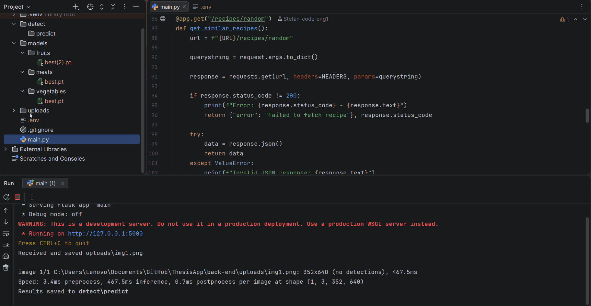

# VisionBite (Bachelor project)

## 📋 Description

**VisionBite** is a smart recipe search application that helps users discover meals based on available ingredients.

The app supports two search methods:
- **Text-based search** for manual ingredient input
- **Image-based search** using a trained YOLO model to detect ingredients from photos

Users can refine results using advanced filters such as cooking time, cuisine, dietary preferences, intolerances, and ingredient inclusion/exclusion.

The application integrates an external recipe API to dynamically fetch relevant recipes based on detected or provided ingredients.

## 🎬 Demo

### 🖥️ Front-end Demo (Recipe Search)


### ⚙️ Back-end Demo (Ingredient Detection)


## ✨ Features

- **Text-Based Recipe Search** – Search recipes by manually entering ingredients  
- **Image-Based Ingredient Detection** – Detect ingredients from images using **three specialized YOLO models**:
  - **Meat model**
  - **Vegetables model**
  - **Fruits model**  
  Trained on **70,000+ images across 27 ingredient classes**  
- **Advanced Filtering System** – Filter recipes by cooking time, cuisine, diet, intolerances, and included/excluded ingredients  
- **API Integration** – Backend fetches real-time recipe data from Spoonacular API  
- **Web App** – Built with React, Vite, and Tailwind CSS, using shadcn/ui and Origin UI components

## 🛠️ Tech Stack

- **Build Tool:** Vite
- **Frontend:** React, JavaScript, Tailwind CSS  
- **UI Components:** shadcn/ui, Origin UI  
- **Backend:** Python, Flask
- **HTTP Requests:** Axios, Requests  
- **APIs:** RapidAPI, Spoonacular API  
- **Machine Learning / CV:** trained YOLO model
  
## 🚀 Quick Start

### Prerequisites

List what needs to be installed beforehand:
- **Node.js** 16.x or higher  
- **npm** or **yarn**  
- **Python** 3.8+  
- **Pip** (Python package manager) 

### Installation

```bash
### Clone the repository
git clone https://github.com/JijeuStefan/ThesisApp.git
cd ThesisApp

# Install dependencies
cd ./back-end
pip install Flask flask-cors requests ultralytics

cd ../recipie-app
npm install
```

### Usage
```bash
# Start the project

cd ./back-end
python app.py

# Create a .env file in the backend folder with your Spoonacular API key:
# API_KEY=your_api_key_here

cd ../recipie-app
npm run dev
```
Open the app in your browser: [http://localhost:5173](http://localhost:5173)

## 📚 Documentation

### Frontend / UI
- [React Documentation](https://react.dev/)
- [Vite Documentation](https://vitejs.dev/)
- [Tailwind CSS Documentation](https://tailwindcss.com/docs)

### Backend
- [Flask Documentation](https://flask.palletsprojects.com/en/2.3.x/)

### APIs
- [Spoonacular API Documentation](https://spoonacular.com/food-api/docs)
- [RapidAPI Documentation](https://docs.rapidapi.com/docs/navigating-this-documentation)

### Machine Learning / YOLO
- [Ultralytics YOLO Documentation](https://docs.ultralytics.com/)

## 📁 Project Structure

```text
ThesisApp/
├── back-end/              # Back-end folder
│   ├── main.py            # Start the server
│   ├── models/            # Destination of the trained YOLO models
│   ├── uploads/           # Uploaded images
│   ├── detect/            # Uploaded images with the detected ingredients
│   └── .env               # API key
├── recipie-app/           # Front-end folder
│   └── src/               # GUI folder
│       ├── App.jsx        # Start the client
│       ├── components/    # shadcn/ui / Origin UI components
│       ├── hooks/         # shadcn/ui / Origin UI hooks
│       └── app/           # GUI logic
│           ├── my_components/      # App components
│           └── my_pages/           # Web page components
└── README.md              # This file
```

## 📝 Usage

This project is developed for educational purposes as part of a bachelor's thesis.

It uses the Spoonacular API for fetching recipe data.

Please note that Spoonacular data is subject to its own terms of use.  
This project is not affiliated with or endorsed by Spoonacular and is intended for educational purposes only.

For more details, see: https://spoonacular.com/food-api/terms

## 👤 Author

**JijeuStefan**
- GitHub: [@JijeuStefan](https://github.com/JijeuStefan)
